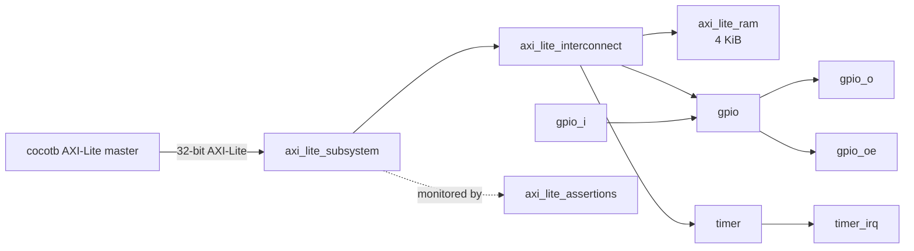
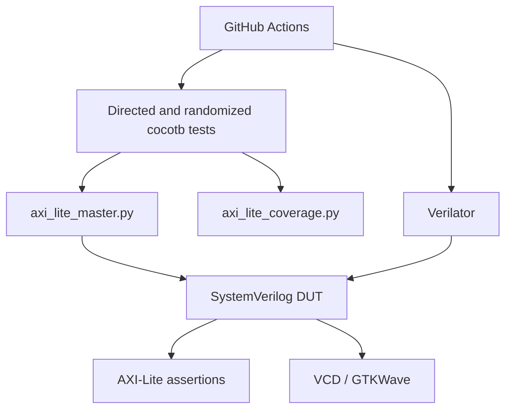

# AXI-Lite SoC Architecture

## 1. Purpose and Scope

This document describes the current RTL and verification architecture of the AXI-Lite RISC-V SoC Verification Platform.

The project name reflects the planned end state. At the current milestone, the implemented design is an AXI-Lite subsystem containing RAM, GPIO, Timer, interconnect, assertions, and a cocotb verification environment. The RV32I processor core and firmware-driven top-level SoC are planned work.

---

## 2. Current System Context



The external master is currently the reusable cocotb AXI-Lite driver. A future RV32I core or adapter will replace or share this role at the full-SoC integration stage.

---

## 3. RTL Hierarchy

```text
axi_lite_subsystem
├── axi_lite_interconnect
├── axi_lite_ram
├── gpio
├── timer
└── axi_lite_assertions
```

### Main Files

| File | Responsibility |
|---|---|
| `rtl/axi_lite_subsystem.sv` | Top-level integration of interconnect, RAM, GPIO, Timer, and assertions |
| `rtl/axi_lite_interconnect.sv` | Address decode, request routing, response routing, and invalid-address responses |
| `rtl/axi_lite_ram.sv` | 4 KiB memory-mapped RAM |
| `rtl/gpio.sv` | Memory-mapped GPIO data, direction, set, and clear registers |
| `rtl/timer.sv` | Counter, compare, match status, and interrupt |
| `rtl/axi_lite_assertions.sv` | External AXI-Lite valid/ready stability checks |
| `include/soc_addr_map.vh` | Global target base addresses and response constants |
| `include/gpio_if.vh` | GPIO register offsets |
| `include/timer_if.vh` | Timer register offsets |

---

## 4. Interface Configuration

| Parameter | Current value |
|---|---:|
| Address width | 32 bits |
| Data width | 32 bits |
| Write strobe width | 4 bits |
| Clock | `ACLK` |
| Reset | `ARESETn`, active low, sampled synchronously on `ACLK` |
| Supported responses | `OKAY`, `SLVERR` |
| Burst support | None; AXI-Lite single-beat transactions |
| IDs | None |
| Multiple masters | Not supported |
| Arbitration | Not required in current one-master architecture |

The read and write paths use the standard AXI-Lite channel groups:

- Write address: `AWADDR`, `AWVALID`, `AWREADY`
- Write data: `WDATA`, `WSTRB`, `WVALID`, `WREADY`
- Write response: `BRESP`, `BVALID`, `BREADY`
- Read address: `ARADDR`, `ARVALID`, `ARREADY`
- Read data: `RDATA`, `RRESP`, `RVALID`, `RREADY`

---

## 5. Interconnect Architecture

### 5.1 Address Decode

The interconnect decodes 4 KiB regions using:

```text
(address & 0xFFFF_F000)
```

The decoded target is one of:

```text
RAM
GPIO
TIMER
ERROR
```

After selection, the interconnect converts the system address to a local target address by subtracting the corresponding base address.

### 5.2 Write Path

The current interconnect and target slaves use a simplified write-acceptance rule:

```text
AWVALID and WVALID must be presented together
```

A write request is accepted only when both write-address and write-data channels are valid while the selected target is ready. The selected target is then retained until the write response completes.

This simplification is compatible with the current cocotb driver, which presents both channels together. It is not yet a fully decoupled implementation of independent AXI-Lite address and data arrival. A future protocol-hardening stage should add separate AW and W buffering before connecting an arbitrary third-party AXI-Lite master.

### 5.3 Write Response Path

The interconnect remembers the selected write target and routes its `BVALID` and `BRESP` back to the external master.

For an unmapped address, the interconnect accepts the write and produces an internal `SLVERR` response without forwarding the request to any target.

Only one write transaction is tracked at a time.

### 5.4 Read Path

The read-address channel is decoded independently from the write path.

The interconnect forwards the local read address to RAM, GPIO, or Timer and retains the selected target until the read response completes.

For an unmapped address, the interconnect returns:

```text
RRESP = SLVERR
RDATA = 0
```

Only one read transaction is tracked at a time.

### 5.5 Read/Write Independence

The design maintains separate read and write selections. A read transaction and a write transaction can progress through their independent channel groups, but the design does not support multiple outstanding reads or multiple outstanding writes.

---

## 6. Target Architecture

### 6.1 RAM

The RAM contains:

```systemverilog
logic [31:0] mem [0:1023];
```

Key characteristics:

- 4 KiB capacity
- 1024 words
- Word-aligned access
- Byte-write support
- Invalid-local-address detection
- AXI interface state reset
- No reset initialization of the memory array

### 6.2 GPIO

The GPIO contains two stored configuration registers:

- `data_out_reg`
- `data_dir_reg`

External behavior:

```text
gpio_o  = data_out_reg
gpio_oe = data_dir_reg
```

`gpio_i` is sampled directly by reads of `DATA_IN`.

Set and clear registers modify `data_out_reg` without requiring a read-modify-write sequence from software.

### 6.3 Timer

The Timer contains:

- `ctrl_reg`
- `count_reg`
- `compare_reg`
- `status_reg`

The timer:

1. Clears state when `CTRL.CLEAR` is observed.
2. Otherwise increments `COUNT` while enabled.
3. Sets `STATUS.MATCH` when the compare condition is reached.
4. Produces `timer_irq` when both match and interrupt-enable are active.
5. Supports write-one-to-clear for the match bit.

---

## 7. Reset Architecture

`ARESETn` is active low but is implemented inside positive-edge clocked processes:

```systemverilog
always_ff @(posedge ACLK) begin
    if (!ARESETn) begin
        ...
    end
end
```

Therefore, reset is synchronous to `ACLK`.

Reset initializes:

- AXI response-valid state
- GPIO output and direction registers
- Timer control, count, compare, status, and interrupt
- Interconnect transaction-selection state
- Assertion history state

Reset does not initialize the RAM storage array.

---

## 8. Assertion Architecture

`axi_lite_assertions.sv` monitors the subsystem's external AXI-Lite interface.

The current assertions check that payload and valid signals remain stable during backpressure:

| Channel | Checked behavior |
|---|---|
| AW | `AWVALID` remains asserted and `AWADDR` remains stable while waiting for `AWREADY` |
| W | `WVALID`, `WDATA`, and `WSTRB` remain stable while waiting for `WREADY` |
| B | `BVALID` and `BRESP` remain stable while waiting for `BREADY` |
| AR | `ARVALID` remains asserted and `ARADDR` remains stable while waiting for `ARREADY` |
| R | `RVALID`, `RDATA`, and `RRESP` remain stable while waiting for `RREADY` |

The assertions are immediate clocked assertions with explicit previous-cycle storage, making them compatible with the current Verilator flow.

Current assertions focus on stability. They do not yet prove response liveness, channel ordering, or complete AXI-Lite compliance.

---

## 9. Verification Architecture



### Verification Components

| Component | Role |
|---|---|
| `tb/axi_lite_master.py` | Reusable reset, read, and write helpers |
| `tb/test_gpio.py` | Standalone GPIO verification |
| `tb/test_timer.py` | Standalone Timer verification |
| `tb/test_axi_lite_ram.py` | Standalone RAM verification |
| `tb/test_axi_lite_subsystem.py` | Interconnect and integrated-subsystem verification |
| `tb/axi_lite_coverage.py` | Lightweight functional coverage collection |
| `Makefile` | Lint, simulation, waveform, cleanup, and regression targets |
| `.github/workflows/regression.yml` | Automated CI regression |

---

## 10. Build and Regression Architecture

The Makefile provides separate simulation-build directories for each top level:

```text
sim_build/gpio
sim_build/timer
sim_build/ram
sim_build/subsystem
```

This avoids stale generated models being reused with the wrong top-level module.

The main regression combines:

- Verilator lint
- GPIO tests
- Timer tests
- RAM tests
- Subsystem tests
- Assertions
- Functional-coverage reporting

The same regression is executed in GitHub Actions.

---

## 11. Current Architectural Limitations

The following limitations are intentional and should be understood before the CPU integration stage:

1. **Write address and write data are not independently buffered.**  
   The current master must present `AWVALID` and `WVALID` together.

2. **Only one outstanding transaction per direction is supported.**  
   There is no queue for multiple reads or writes.

3. **There is one external master.**  
   No arbitration or multi-master coherency is implemented.

4. **Only `OKAY` and `SLVERR` are generated.**

5. **The RAM has no reset initialization or firmware-loading mechanism yet.**

6. **The current assertions check stability, not complete protocol liveness.**

7. **No RV32I core is integrated yet.**

These limitations do not invalidate the current verification milestone; they define the boundary of its specification.

---

## 12. Planned Evolution

Recommended order for the next stages:

1. Freeze and tag the verified subsystem milestone.
2. Improve AXI-Lite write-channel decoupling with AW and W buffers.
3. Add targeted response-backpressure tests.
4. Add a simple RV32I core or native-to-AXI-Lite adapter.
5. Add RAM program initialization.
6. Integrate `soc_top.sv`.
7. Run firmware that reads/writes RAM, drives GPIO, and services the timer.
8. Add instruction-level reference checking and, later, formal RISC-V verification.
