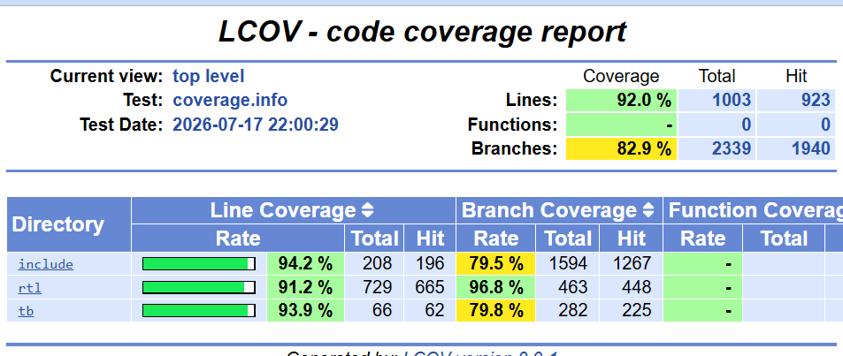
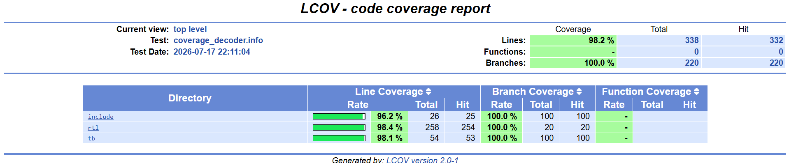

# Coverage Summary

## Overview

The project uses two complementary coverage methods:

1. Python functional coverage for AXI-Lite transactions and peripheral behavior.
2. Verilator RTL line and branch coverage for the RV32I processor hierarchy.

## RV32I Core Regression

All end-to-end processor tests pass.

| Metric | Result |
|---|---:|
| Core tests | 13/13 PASS |
| Overall line coverage | 92.0% — 923/1003 |
| Overall branch coverage | 82.9% — 1940/2339 |
| RTL line coverage | 91.2% — 665/729 |
| RTL branch coverage | 96.8% — 448/463 |
| `rv32i_core.sv` line coverage | 93.5% — 174/186 |
| `rv32i_core.sv` branch coverage | 99.4% — 335/337 |

The overall result includes RTL, SystemVerilog interfaces, and the cocotb
wrapper. The RTL-only result includes processor source files under `rtl/`.



## Decoder Coverage

| Metric | Result |
|---|---:|
| Overall line coverage | 98.2% — 332/338 |
| Overall branch coverage | 100.0% — 220/220 |
| Decoder RTL line coverage | 98.4% — 254/258 |
| Decoder RTL branch coverage | 100.0% — 20/20 |

The decoder suite covers:

- All supported RV32I instruction forms
- Invalid R-type `funct7` values
- Invalid shift-immediate `funct7` values
- Invalid load, store, branch, JALR, and FENCE encodings
- Unsupported CSR instructions
- Unknown opcodes
- Illegal-instruction side-effect suppression

The four remaining uncovered decoder line entries do not represent uncovered
decision paths because decoder branch coverage is 100%.



## AXI-Lite Functional Coverage

The current AXI-Lite subsystem functional coverage is:

```text
96%